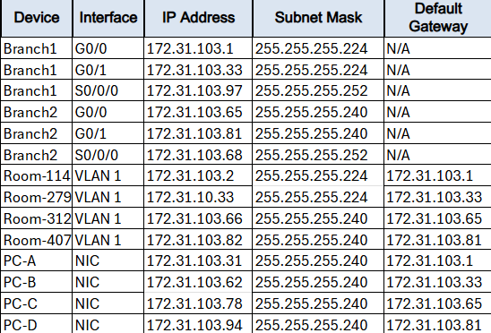
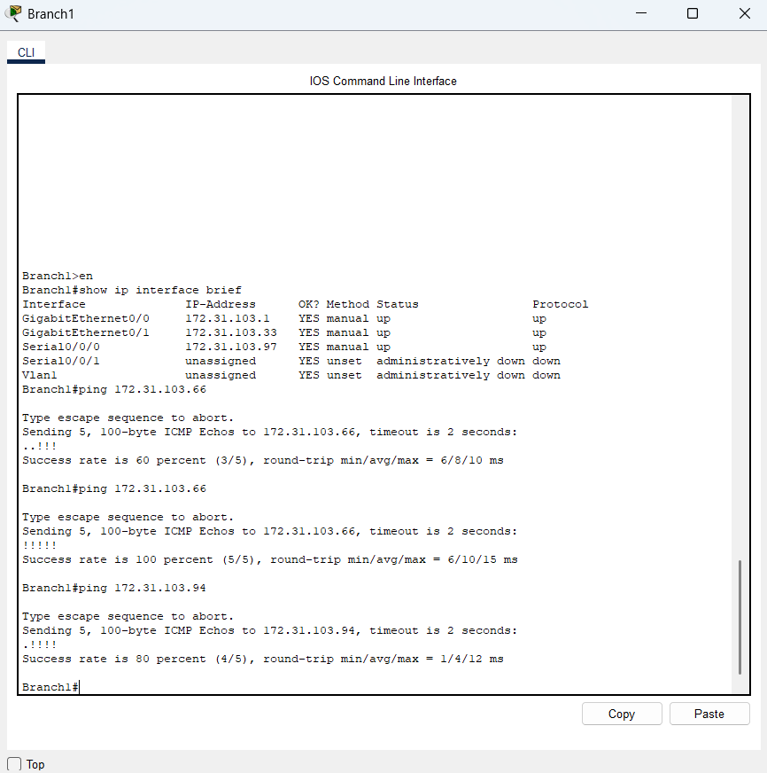

# Lab 01 — VLSM Subnetting Design and Implementation

## Description
Design and implementation of a VLSM addressing scheme over the `172.31.103.0/24` network,
divided into 5 subnets based on host requirements per area.
Full configuration of routers and switches with end-to-end connectivity verification.

**Tool:** Cisco Packet Tracer  
**Course:** Cisco Networking Academy — CCNA  
**Completion:** 100% ✓

---

## Network Topology

---

## VLSM Subnet Table

---

## Connectivity Verification

Connectivity verified from Branch1, Room-312, and PC-D using ping to all addresses in the addressing table.

---

## Skills Demonstrated

- Variable Length Subnet Masking (VLSM)
- Subnet calculation: network address, first host, broadcast
- Cisco IOS interface configuration on routers
- Default gateway assignment on switches and hosts
- End-to-end connectivity testing

---
## Credits
Lab based on Cisco Networking Academy curriculum (CCNA).  
Topology and network requirements are part of the course material.  
Solution, configuration, and documentation are my own work.
