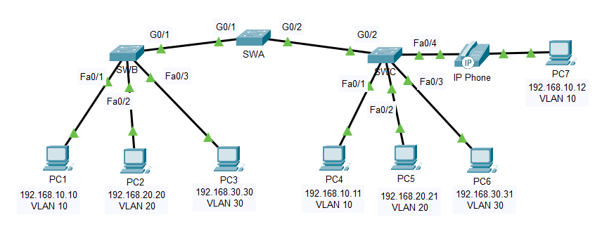
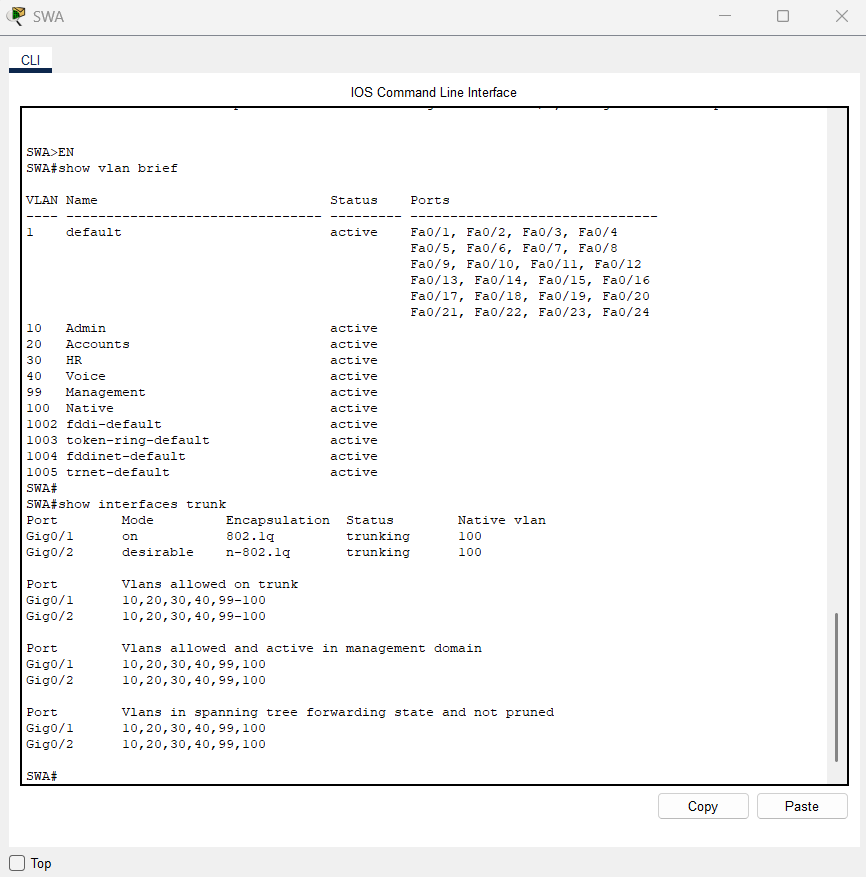
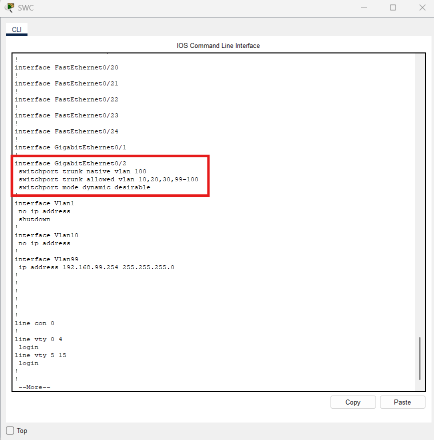

# Lab 02 — VLANs and Trunking Implementation

## Description
This lab simulates a branch office network deployment using three Cisco 2960 
switches (SWA, SWB, SWC). The goal is to configure and verify VLANs and 
trunking to segment network traffic by department.

**The lab covers four main tasks:**

- Creating and naming 6 VLANs across all switches (Admin, Accounts, HR, Voice, Management, Native)
- Assigning access ports to the correct VLANs, including a voice VLAN port for IP telephony on SWC
- Configuring a static trunk between SWA and SWB with DTP disabled and native VLAN set
- Configuring dynamic trunking between SWA and SWC using DTP negotiation

**Tool:** Cisco Packet Tracer  
**Course:** Cisco Networking Academy — CCNA  
**Completion:** 100% ✓

---

## Network Topology

---

## VLAN Table

| VLAN | Name       |
|------|------------|
| 10   | Admin      |
| 20   | Accounts   |
| 30   | HR         |
| 40   | Voice      |
| 99   | Management |
| 100  | Native     |

---

## Addressing Table

| Device | Interface | IP Address      | Subnet Mask     | VLAN        |
|--------|-----------|-----------------|-----------------|-------------|
| PC1    | NIC       | 192.168.10.10   | 255.255.255.0   | VLAN 10     |
| PC2    | NIC       | 192.168.20.20   | 255.255.255.0   | VLAN 20     |
| PC3    | NIC       | 192.168.30.30   | 255.255.255.0   | VLAN 30     |
| PC4    | NIC       | 192.168.10.11   | 255.255.255.0   | VLAN 10     |
| PC5    | NIC       | 192.168.20.21   | 255.255.255.0   | VLAN 20     |
| PC6    | NIC       | 192.168.30.31   | 255.255.255.0   | VLAN 30     |
| PC7    | NIC       | 192.168.10.12   | 255.255.255.0   | VLAN 10/40  |
| SWA    | SVI       | 192.168.99.252  | 255.255.255.0   | VLAN 99     |
| SWB    | SVI       | 192.168.99.253  | 255.255.255.0   | VLAN 99     |
| SWC    | SVI       | 192.168.99.254  | 255.255.255.0   | VLAN 99     |

---

## Verification
# VLAN and Trunk Verification -SWA

# Dynamic Trunking Verification -SWC (DTP)

G0/2 on SWC configured to successfully negotiate trunking with SWA using DTP.

---

## Credits
Lab based on Cisco Networking Academy curriculum (CCNA).  
Topology and network requirements are part of the course material.  
Solution, configuration, and documentation are my own work.
