# Lab 03 — Layer 3 Switching and Inter-VLAN Routing

## Description
This lab demonstrates the dual functionality of a Cisco Catalyst 3650 multilayer switch,
capable of both Layer 2 switching and Layer 3 routing. Instead of using a separate router,
a single multilayer switch (MLS) is configured to route traffic between VLANs using
Switched Virtual Interfaces (SVIs). The lab also covers IPv6 inter-VLAN routing,
simulating a dual-stack network with routed connectivity to an external cloud address.

**Tool:** Cisco Packet Tracer  
**Course:** Cisco Networking Academy — CCNA  
**Completion:** 100% ✓

---

## Network Topology

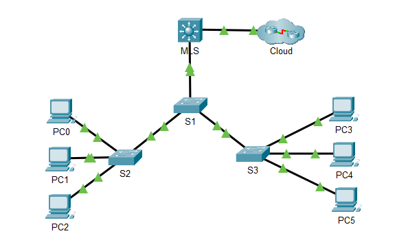

---

## Addressing Table

| Device | Interface | IPv4 Address          | IPv6 Address                  |
|--------|-----------|-----------------------|-------------------------------|
| MLS    | VLAN 10   | 192.168.10.254/24     | 2001:db8:acad:10::1/64        |
| MLS    | VLAN 20   | 192.168.20.254/24     | 2001:db8:acad:20::1/64        |
| MLS    | VLAN 30   | 192.168.30.254/24     | 2001:db8:acad:30::1/64        |
| MLS    | VLAN 99   | 192.168.99.254/24     | —                             |
| MLS    | G0/2      | 209.165.200.225       | 2001:db8:acad:a::1/64         |
| PC0    | NIC       | 192.168.10.1          | —                             |
| PC1    | NIC       | 192.168.20.1          | —                             |
| PC2    | NIC       | 192.168.30.1          | —                             |
| PC3    | NIC       | 192.168.10.2/24       | 2001:db8:acad:10::2/64        |
| PC4    | NIC       | 192.168.20.2/24       | 2001:db8:acad:20::2/64        |
| PC5    | NIC       | 192.168.30.2          | 2001:db8:acad:30::2/64        |
| S1     | VLAN 99   | 192.168.99.1          | —                             |
| S2     | VLAN 99   | 192.168.99.2          | —                             |
| S3     | VLAN 99   | 192.168.99.3          | —                             |

---

## VLAN Table

| VLAN | Name    |
|------|---------|
| 10   | Staff   |
| 20   | Student |
| 30   | Faculty |
| 99   | Management |

---

## Part 1 — Layer 3 Switching

G0/2 on MLS configured as a routed port (no switchport) with IPv4 and IPv6 addressing.
Verified connectivity to Cloud at 209.165.200.226.

---

## Part 2 — IPv4 Inter-VLAN Routing

SVIs configured on MLS for VLANs 10, 20, 30, and 99.
IP routing enabled with `ip routing` command.

### IPv4 Routing Table (show ip route)

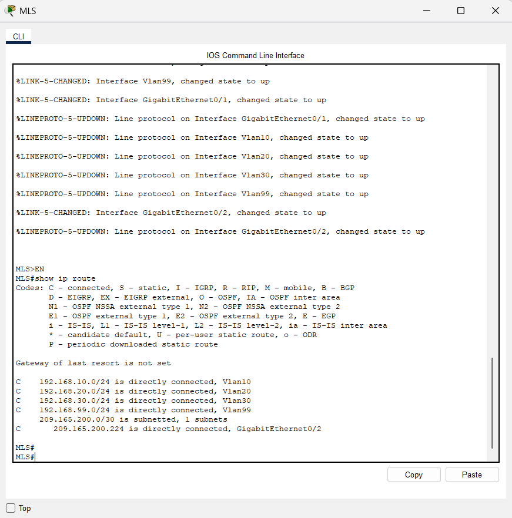

### Connectivity Verification

** PC0 → PC3 or MLS (VLAN 10)**

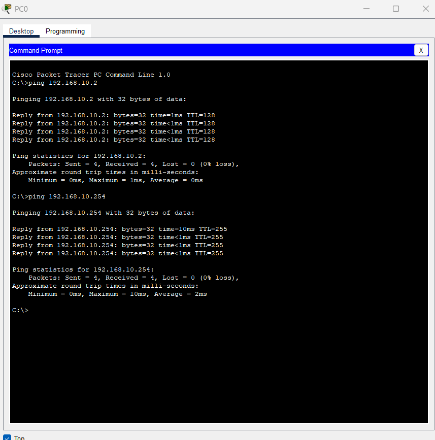

** PC1 → PC4 or MLS (VLAN 20)**

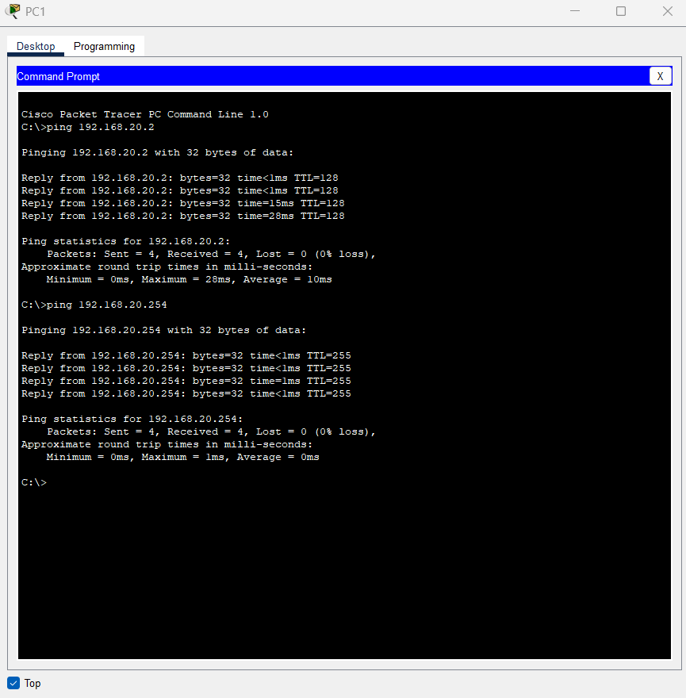

** PC2 → PC5 or MLS (VLAN 30)**

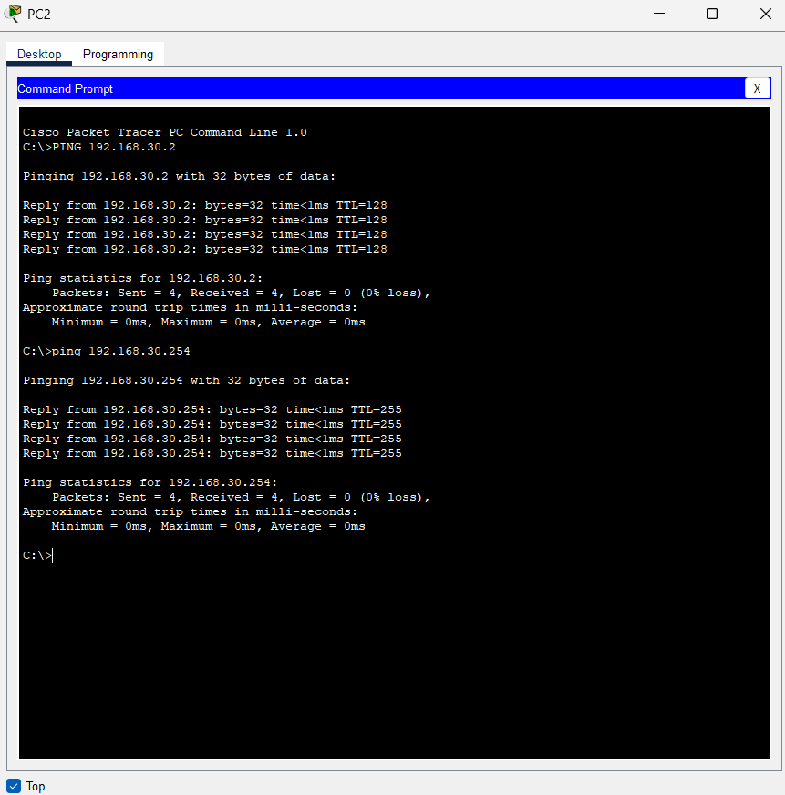

** S1 → S2, S3 or MLS (VLAN 99)**

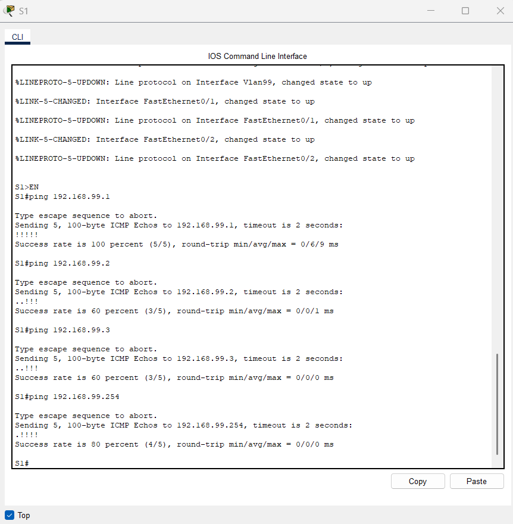

** Any device → Cloud (209.165.200.226)**

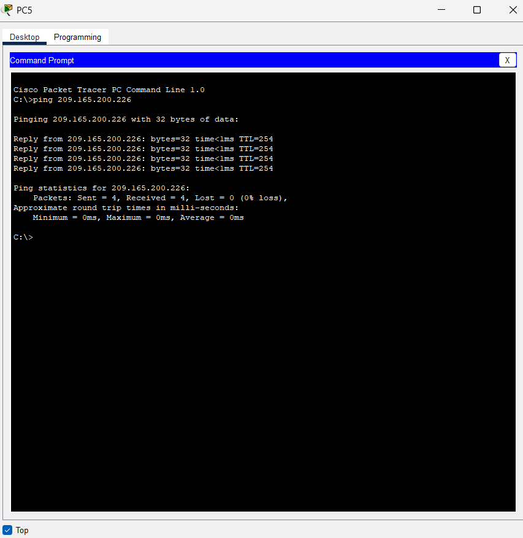

---

## Part 3 — IPv6 Inter-VLAN Routing

IPv6 routing enabled with `ipv6 unicast-routing` command.
SVIs configured with IPv6 addresses for VLANs 10, 20, and 30.
G0/2 configured with IPv6 address for cloud connectivity.

### IPv6 Routing Table (show ipv6 route)

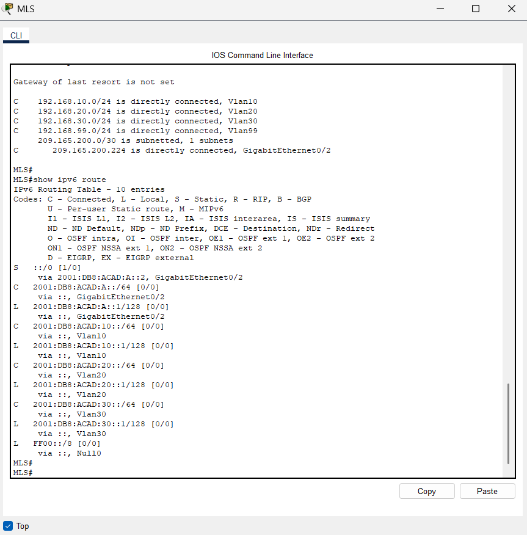

### IPv6 connectivity verification 

** PC3 →MLS (VLAN 10)**

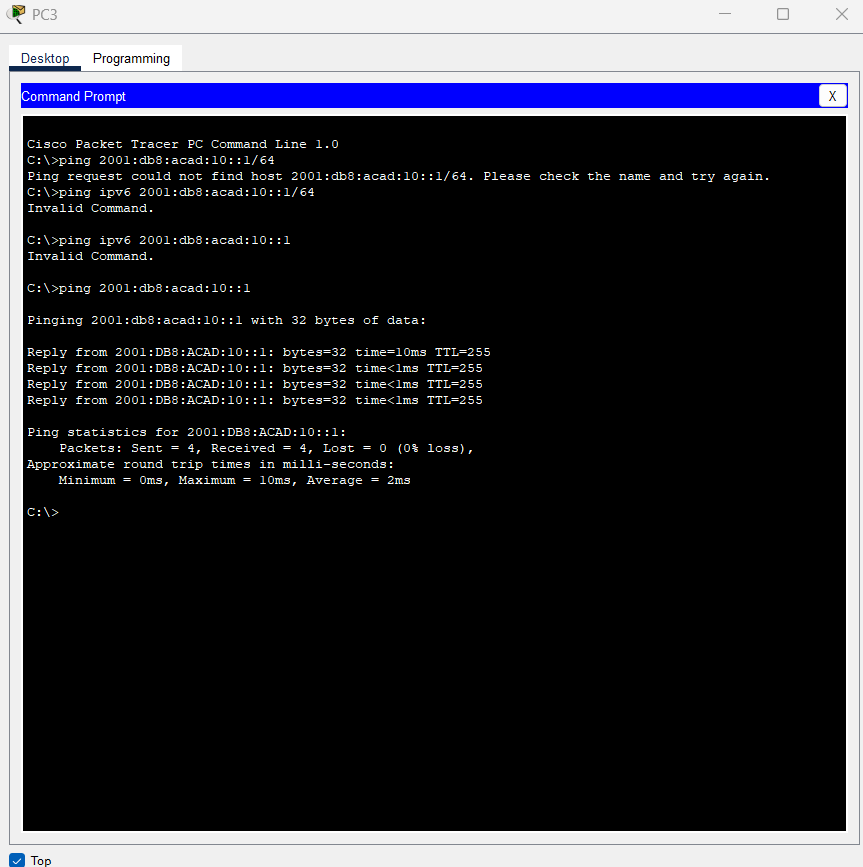

** PC4 →MLS (VLAN 20)**

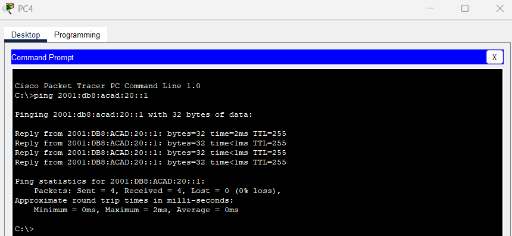

** PC5 →MLS (VLAN 30)**

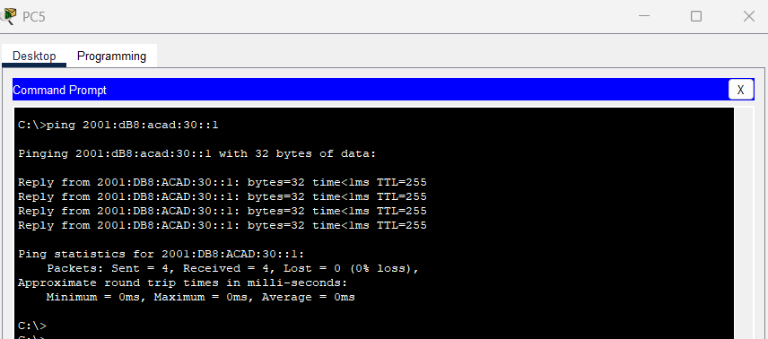

** Inter-VLAN routing PC4 →PC5 and Cloud **

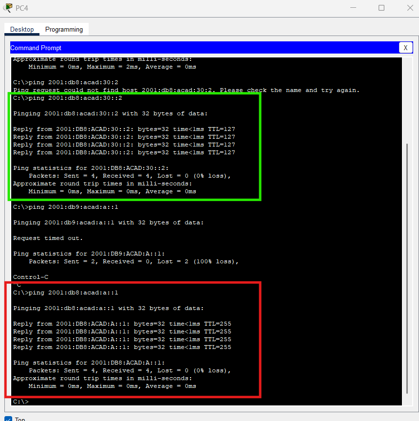
---

## Credits
Lab based on Cisco Networking Academy curriculum (CCNA).  
Topology and network requirements are part of the course material.  
Solution, configuration, and documentation are my own work.
